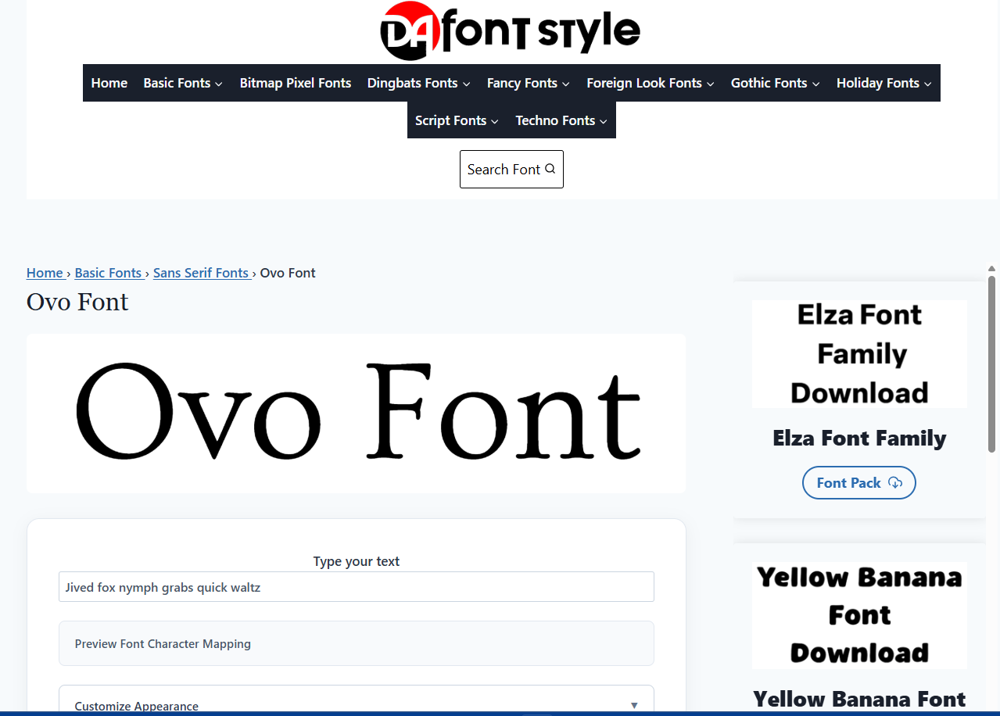

# DafontStyle

## Free Fonts, Font Previewing, and Typography Resources

Finding a font should not require opening dozens of tabs, downloading a ZIP file before knowing how the typeface looks, or guessing whether the font matches the project you have in mind. DafontStyle.io focuses on a simpler workflow: discover a font, preview it with your own text, review the available font information, and download the font package when it fits your needs.

DafontStyle is a font discovery and download website for designers, developers, students, creators, and anyone who needs a typeface for a project. The site organizes fonts by style and provides font pages where visitors can preview typography before downloading.

> **Website:** https://dafontstyle.io/

---

## What is DafontStyle.io?

Dafont Style is an online font library focused on font discovery, previewing, and downloading. Visitors can browse fonts, open individual font pages, test custom text, and download available font files.

The project exists around a straightforward problem: choosing a font is easier when you can see the actual typeface before you download it.

A font name alone rarely tells you whether a typeface will work for a logo, poster, social media graphic, website heading, invitation, packaging design, presentation, or personal project. A live preview gives the visitor a more useful way to evaluate the font.

DaFontstyle also groups fonts into recognizable categories such as sans serif, script, calligraphy, gothic, cartoon, handwritten, fancy, and other typography styles. Category browsing helps visitors discover fonts when they know the visual direction they want but do not know the exact font name.

The project does not treat font discovery as a simple download button. The useful workflow starts before the download:

1. Find a font.
2. Open its font page.
3. Preview the typeface.
4. Test your own text.
5. Check the available font and license information.
6. Download the available package.
7. Install or use the font according to its license terms.

---

## Search Intent Behind DafontStyle

People arrive at a font website with different goals. A good font resource needs to support those goals without forcing every visitor through the same path.

### Navigational intent

Some visitors already know the website name and search for **DafontStyle.io** because they want to return to the font library.

For these users, the important things are simple:

- A recognizable website name.
- Easy access to the font search.
- Clear category navigation.
- Fast access to individual font pages.
- A predictable preview and download workflow.

### Transactional intent

Other visitors want to download a specific font or find a free font for a project.

Typical searches include:

- free fonts download
- download fonts
- free font ZIP
- TTF font download
- OTF font download
- script fonts download
- calligraphy fonts
- handwritten fonts
- gothic fonts
- sans serif fonts
- commercial use fonts
- personal use fonts

These visitors usually want to move from discovery to preview to download with as little friction as possible.

### Informational intent

Some visitors need help with the font itself.

They may ask:

- How do I install a TTF font?
- How do I install an OTF font?
- Can I use this font commercially?
- What does personal use mean?
- How can I preview a font with my own text?
- What is the difference between TTF and OTF?
- How do I choose a font for a logo?
- Where should I check the license?

A useful font platform needs to answer these questions because downloading a file is only one part of using typography correctly.

---

## The Problem DafontStyle Solves

Font selection often starts with a visual requirement rather than a technical one.

A designer may need a handwritten font for a wedding invitation. A content creator may need a bold display font for a thumbnail. A developer may need a readable typeface for a website heading. A student may simply need a font for a personal project.

The common problem is the same: **the visitor needs to identify a suitable typeface quickly.**

A font archive can become difficult to use when the visitor has to download every candidate before testing it. DafontStyle.io puts previewing closer to the discovery process.

For example, imagine a designer preparing a poster. They find a script font that looks promising from its preview image. Instead of downloading several versions immediately, they can open the font page and test the actual words that will appear on the poster.

That small step can save time because typography changes significantly when the text changes.

A font that looks attractive with the alphabet may not work well for a specific name, headline, or short phrase. Custom preview text gives the visitor a more realistic test.

---

## How the Dafont Style Workflow Works

  

The site follows a practical discovery workflow.

### 1. Browse or search for a font

Visitors can start with a font name or browse categories based on style.

If the exact name is known, search usually makes the fastest route. If the visitor only knows the visual style, category browsing provides a more useful starting point.

### 2. Open the font page

The individual font page brings the font information together in one place.

A useful font page should answer the basic questions before the visitor downloads anything:

- What is the font called?
- What does it look like?
- What category does it belong to?
- Can I preview my own text?
- What file format is available?
- What license information is shown?
- Where can I download the font?

### 3. Preview custom text

The preview step matters because font selection depends on the actual content.

Try the exact word, name, heading, phrase, or sentence that you plan to use. This gives a more realistic view than testing a generic alphabet alone.

For example, a designer working on a logo should test the brand name. A creator making a social graphic should test the actual headline. Someone creating an invitation should test the names and important wording.

### 4. Review license information

A font can appear free while still carrying restrictions.

The word "free" does not automatically mean that every use is allowed. Some fonts permit personal projects but require a separate license for commercial work.

Always read the license information supplied with the font and, when necessary, check the author's original license or official source.

### 5. Download the font package

Available font downloads commonly use ZIP packages containing font files such as `.ttf` or `.otf`.

After downloading, extract the ZIP file before installing the font.

---

## Why Font Previewing Matters

Font previewing sounds simple, but it solves one of the most common problems in font selection.

Typography depends on the letters that actually appear in the project.

Two fonts may look similar when displayed with a standard sample but behave differently with a real heading. Letter spacing, character shapes, uppercase forms, lowercase forms, numbers, punctuation, and stylistic details can change the result.

A custom preview helps answer practical questions:

- Does the font make my text readable?
- Does the style fit the project?
- Do the letters connect correctly?
- Does the font support the characters I need?
- Does the text look balanced at the intended size?
- Does the font work better as a heading or body text?

This approach also reduces unnecessary downloads. Instead of collecting fonts first and testing them later, visitors can evaluate promising options during discovery.

---

## Font Categories and Discovery

People rarely search for typography using technical classifications alone.

A visitor may search for a "cute font," "tattoo font," "wedding font," "modern font," or "handwriting font." Another visitor may know terms such as serif, sans serif, script, or gothic.

Category pages can bridge those two behaviors.

DafontStyle.io organizes fonts into visual and typographic categories so visitors can browse beyond exact-name searches.

Common discovery categories include:

- Basic fonts
- Sans serif fonts
- Serif fonts
- Script fonts
- Calligraphy fonts
- Handwritten fonts
- Gothic fonts
- Cartoon fonts
- Fancy fonts
- Dingbats
- Display fonts
- Decorative fonts

Category labels help visitors narrow a large font collection into a more manageable group.

The most useful category is not always the most technically precise category. It is the category that helps the visitor make progress toward the font they need.

---

## TTF, OTF, and ZIP Files

Font websites often provide fonts in ZIP archives because a single download can contain multiple files and supporting documents.

### TTF

TTF stands for TrueType Font.

TTF remains one of the most widely supported desktop font formats. Many operating systems and design applications can install and use TTF files directly.

### OTF

OTF stands for OpenType Font.

OpenType supports advanced typography features and can include capabilities that go beyond a basic font file.

The actual feature set depends on how the font creator built the typeface.

### ZIP

A ZIP file packages one or more files into a single compressed download.

A font ZIP may contain:

- TTF files
- OTF files
- Multiple font weights or styles
- License information
- Readme files
- Documentation

Do not install the ZIP file itself as the font. Extract it first and identify the actual font files.

---

## Personal Use vs Commercial Use

License checking deserves special attention because this is where many font users make mistakes.

A font page may describe a font as free, but that wording does not automatically grant unlimited commercial rights.

### Personal use

Personal-use licensing commonly covers non-commercial projects, but the exact definition depends on the font license.

Examples can include personal artwork, private projects, school work, or other uses that do not generate commercial value. Always read the specific license because each creator can define permitted use differently.

### Commercial use

Commercial use generally involves work connected to a business, client, product, service, advertising, monetized content, or other commercial activity.

The exact permissions depend on the font license.

A designer creating a logo for a paying client should not assume that a font marked "free" automatically permits that use.

### The safest habit

Check the license before using the font in a commercial project.

If the license does not clearly answer your question, look for the creator's official source or contact the creator.

Do not treat a download label as a replacement for the actual license.

---

## A Common Font Download Mistake

One of the most common mistakes looks harmless:

> "The website says free, so I can use it anywhere."

That assumption can create problems later.

A font can be available for free download while still restricting commercial use. The creator may allow personal use but require a paid license for client work, products, advertising, or other commercial applications.

Another common mistake involves downloading a font without checking what the ZIP contains.

A package may include several styles, a license document, and different file formats. Installing every file without checking the names can create duplicate fonts or confusion between regular, bold, italic, and other styles.

A better workflow is simple:

1. Extract the ZIP.
2. Read the included documentation.
3. Identify the actual font files.
4. Check the license.
5. Install only the styles you need.

---

## Installing Fonts After Download

The installation process depends on the operating system.

### Windows

After downloading the ZIP:

1. Open the ZIP file.
2. Extract its contents.
3. Locate the `.ttf` or `.otf` file.
4. Right-click the font file.
5. Choose the installation option provided by Windows.
6. Restart an application if it does not immediately detect the new font.

You can then use the font in supported applications such as Microsoft Word, Adobe applications, graphics software, and other desktop programs.

### macOS

On macOS:

1. Extract the ZIP file.
2. Locate the `.ttf` or `.otf` file.
3. Open the font file.
4. Font Book will display the font.
5. Use the installation option in Font Book.

After installation, supported applications can access the typeface.

### Mobile devices

Mobile font installation works differently from desktop installation.

Some iOS and Android workflows require a font-management application or an application that supports custom fonts. The exact process depends on the operating system version and the app where you want to use the font.

Do not assume that downloading a TTF file automatically installs it across every mobile application.

---

## Using DafontStyle.io for Design Work

A font library becomes more useful when visitors use it as part of a selection process instead of treating it as a file warehouse.

### Logos and branding

For logos, test the exact brand name rather than a generic sample.

Look closely at:

- Letter shapes
- Spacing
- Capital letters
- Distinctive characters
- Readability at small sizes
- Overall visual balance

Also check the license before using the font in a client or commercial identity.

### Social media graphics

Display fonts can work well for short headlines and promotional graphics.

Test the actual headline because decorative fonts can become difficult to read when the text contains unusual letter combinations or long words.

### Invitations

Script and calligraphy fonts often suit invitations, greeting cards, wedding designs, and similar projects.

Preview names and important phrases before choosing a font. Some decorative typefaces look excellent with individual letters but become difficult to read in longer lines.

### Websites

Web use requires additional consideration.

A desktop font license does not automatically guarantee permission for web embedding. Check whether the license allows web use and whether the font creator provides a webfont version.

Also consider performance. Large font files and unnecessary font weights can increase page weight.

---

## A Practical Font Selection Method

If you have hundreds of possible fonts, downloading everything will not make the decision easier.

Use a shortlisting process instead.

### Step 1: Define the job

Ask what the font needs to do.

Is it for:

- A logo?
- A headline?
- Body text?
- A poster?
- A social media post?
- An invitation?
- Packaging?
- A personal project?
- A website?

### Step 2: Choose a visual direction

Decide whether you need a clean, formal, handwritten, decorative, technical, playful, vintage, gothic, or modern style.

### Step 3: Shortlist several candidates

Do not install every font immediately.

Open promising font pages and compare the actual text you plan to use.

### Step 4: Check readability

A font can look impressive in a preview image but become difficult to read in a real sentence.

### Step 5: Check the license

Do this before using the font in the final project, especially for client and commercial work.

### Step 6: Install only what you need

Keeping hundreds of unused fonts installed can make font menus difficult to navigate.

A smaller working collection usually makes selection faster.

---

## What Makes a Font Resource Useful?

A large font count alone does not solve the user's problem.

A useful font resource should reduce the work between "I need a font" and "I found the right font."

That requires several parts to work together:

- Search
- Categories
- Font previews
- Custom text testing
- Clear font pages
- Download access
- File format information
- License information
- Installation guidance
- Helpful typography resources

This combination matters because font discovery is not only a download task. It is a selection task.

---

## DafontStyle.io Compared With Other Font Resources

The font ecosystem contains many different types of resources.

DaFont has a large archive and lets visitors browse fonts by categories, authors, popularity, and other discovery methods. Its own guidance also emphasizes checking the license information in downloaded archives because a download label does not replace the actual license terms.

Google Fonts focuses on open-source fonts and web integration, making it particularly useful when a project needs a font that works well across websites and applications.

Font Squirrel focuses strongly on fonts that creators can use commercially, while FontSpace provides another large font discovery platform.

These sites serve overlapping but different needs. DafontStyle.io focuses on a straightforward discovery experience built around browsing, previewing, and downloading fonts.

The important point is not to assume that every font platform follows the same licensing model. The license belongs to the font, not to the general idea of a font website.

---

## What DafontStyle.io Is Not

DafontStyle.io is a font discovery and download resource. It should not be treated as a blanket license for every font listed on the site.

The presence of a font on a website does not replace the creator's license.

If you plan to use a font commercially, especially for a client, logo, product, application, website, or merchandise, verify the specific licensing terms.

This distinction protects both designers and font creators.

---

## Practical Tips That Save Time

### Preview the exact text

This is one of the easiest improvements to the font-selection process.

Do not test only "The quick brown fox" if your project will display a company name or a specific phrase. Enter the real text.

### Test at the final size

A font can look excellent at a large preview size and become unclear when you reduce it.

If the font will appear on a small label, thumbnail, mobile interface, or compact heading, test it at a similar size.

### Check numbers and punctuation

Designers often focus on letters and forget numbers.

If your project contains prices, dates, phone numbers, statistics, or years, preview those characters too.

### Keep license records

For client projects, keep a copy of the license or the creator's licensing page with your project files.

This makes future verification easier if the project returns months later.

### Do not confuse a font preview with a font license

A preview tells you how the typeface looks.

It does not tell you what legal uses the license permits.

Keep those two questions separate.

---

## The Bigger Goal of the Project

DafontStyle.io aims to make font discovery practical.

The project combines a searchable font collection with category browsing and font previews so visitors can spend less time downloading fonts blindly and more time evaluating the typefaces that actually fit their projects.

For a designer, that can mean faster shortlisting.

For a developer, it can mean easier typography research.

For a student or hobbyist, it can mean finding a suitable font without needing specialist typography knowledge.

For anyone who regularly works with fonts, the basic principle stays the same: **see the font, test the text, check the license, then download.**

---

## Frequently Asked Questions

### What is DafontStyle.io?

DafontStyle.io is an online font discovery and download website. It provides font pages, category browsing, custom text previews, and downloadable font packages.

### Can I preview a font before downloading it?

Yes. DafontStyle.io provides font preview functionality so visitors can test typography before downloading a font.

### Can I type my own text in a font preview?

Yes. Custom text preview lets you test the words or phrases that you actually plan to use.

### Does "free font" always mean commercial use is allowed?

No. A font can be free to download while still restricting commercial use. Check the specific license before using a font for a business, client, product, advertisement, website, or other commercial project.

### What is the difference between TTF and OTF?

TTF and OTF are font file formats. Both can work on modern operating systems, while OTF can support advanced OpenType typography features depending on how the font creator built the font.

### Why do font websites use ZIP files?

ZIP files make it easier to package font files, multiple styles, license documents, readme files, and other supporting resources into one download.

### How do I install a downloaded font on Windows?

Extract the ZIP file, locate the TTF or OTF file, and use the Windows font installation option. If an application was already open, restart it so it can detect the newly installed font.

### How do I install a font on macOS?

Extract the ZIP file, open the TTF or OTF file, and install it through Font Book.

### Can I use DafontStyle.io fonts for a logo?

That depends on the specific font license. Check the license before using a font in a logo or other commercial identity.

### Can I use a DafontStyle.io font on a website?

That depends on the font license and the type of web use. Check whether the license permits web embedding and whether the creator provides an appropriate webfont format.

### How can I find a font if I do not know its name?

Start with the visual style you need and browse relevant categories. If you have an image of the font, you can also use font-identification tools and then search for the identified typeface.

### Should I install every font I download?

No. Install the fonts you actually need. Keeping a focused font collection makes font menus easier to use and reduces clutter.

### What should I check before downloading a font?

Check the font preview, file formats, available styles, creator information when provided, and license information. If the font will support commercial work, verify that the license covers your intended use.

### Where can I get free fonts?

You can browse free font resources such as DafontStyle.io and other established font libraries. Always review the individual font license because different resources and different fonts can have different usage conditions.

---

## Project Principles

DafontStyle.io follows a few practical principles for the font discovery experience:

- **Preview before download.**
- **Make font discovery simple.**
- **Keep categories useful.**
- **Help visitors understand font formats.**
- **Encourage license checking.**
- **Avoid treating "free" as a universal license.**
- **Help users choose fonts using their actual project text.**
- **Keep the experience focused on typography.**

These principles matter because a font archive should help people make a useful typography decision, not simply provide a large list of files.

---

## Contributing

This repository can serve as the public project documentation for DafontStyle.io.

If you want to contribute, improve the documentation, report a technical issue, suggest a useful typography resource, or propose an improvement to the website experience, open an issue or pull request with enough detail for the change to be reviewed.

For font-related contributions, include licensing information and the original source whenever applicable. Do not submit font files that you do not have permission to redistribute.

### Contribution checklist

Before opening a pull request:

- Explain what you changed.
- Explain why the change improves the project.
- Keep documentation clear and factual.
- Avoid unsupported licensing claims.
- Do not upload copyrighted font files without redistribution permission.
- Test code changes before submitting them.
- Keep unrelated changes out of the same pull request.

---

## License and Font Rights

The website code, documentation, design assets, and font files can have different rights.

A repository license does not automatically change the license of fonts referenced or distributed by the website.

If this repository contains code, the repository owner should specify the applicable software license in a separate `LICENSE` file.

Font files remain subject to their own licenses and creator rights.

Always review the license that applies to a specific font before redistributing, modifying, embedding, or using it commercially.

---

## Useful Links

- Website: https://dafontstyle.io/
- Font download pages: https://dafontstyle.io/
- Font installation guide: https://dafontstyle.io/how-to-install-fonts-from-dafont-style

---

## Final Note

Good typography starts with choosing the right typeface for the actual job.

DafontStyle.io is built around that simple idea. Search for a font, explore the style, preview your own text, review the license, and download the file when it fits your project.

If you use fonts regularly, make license checking part of the workflow rather than treating it as an afterthought.

